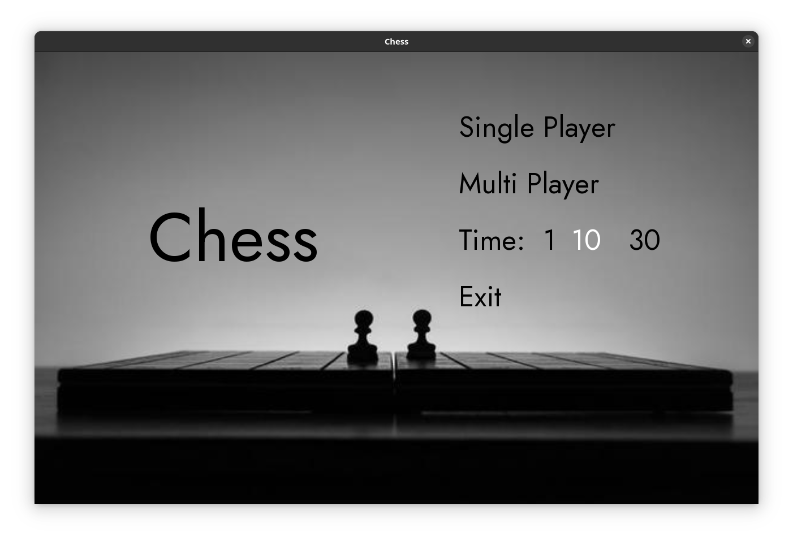
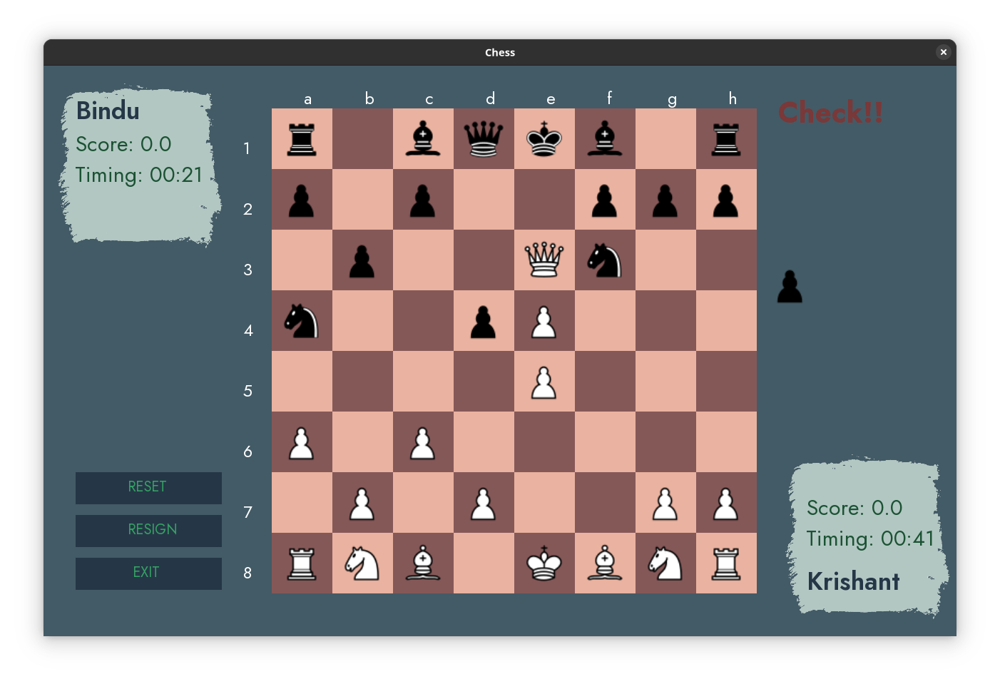
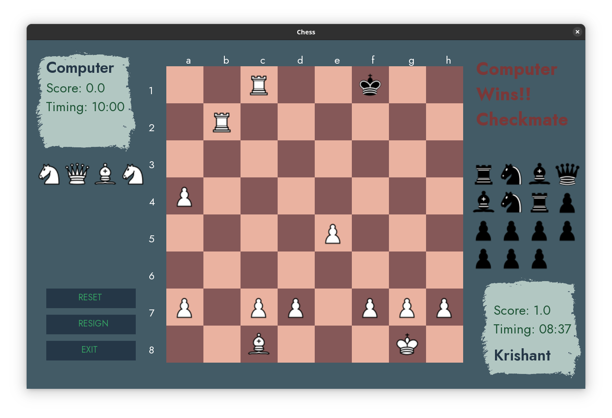
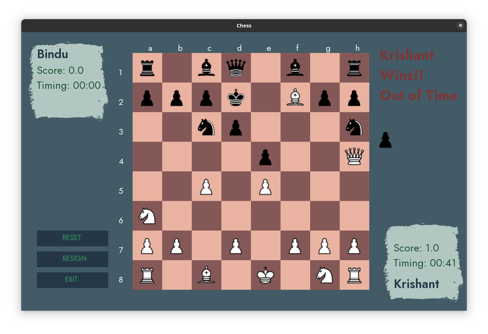
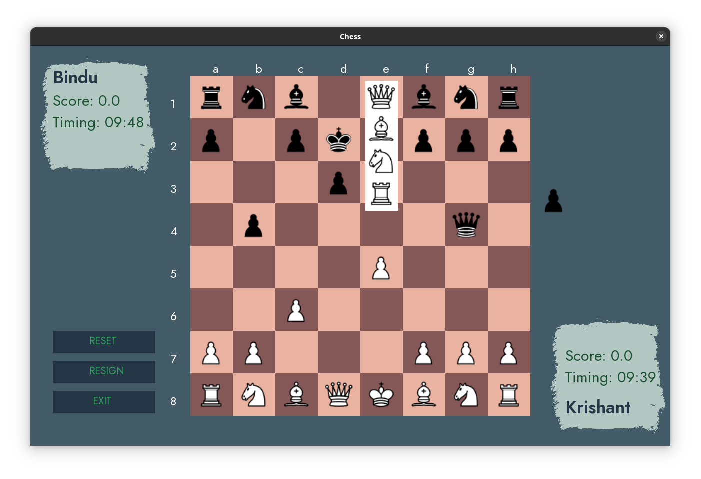

# CHESS

This is a cross-platform Chess game made using SFML.

## Contributors
```
Bindu Paudel          (078BCT032)
Krishant Timilsina    (078BCT045)
```

## SCREENSHOTS


<b><center>GameMenu</center>
</b>

<b><center>Check</center>


<b><center>CheckMate</center></b>


<b><center>OutofTime</center></b>


<b><center>Promote</center>

</b>
<b><center>Resign</center></b>

## 🔨 Build

###  📋 Requirements

To setup and use the project you will need to have the following tools installed:
 - [Xmake](https://xmake.io/)

For windows, MCVC is recommended.

###  ⬇️ Installation

Clone the repository

```PS
$ git clone https://github.com/bigya01/chess_rl.git
``````


Change the working directory to the newly cloned repository:

```PS
$ cd chess_rl
```

Run xmake to install the dependencies & build the project:

```PS
$ xmake
checking for platform ... windows
checking for architecture ... x64
checking for Microsoft Visual Studio (x64) version ... 2022
checking for Microsoft C/C++ Compiler (x64) version ... 19.37.32822
[  5%]: compiling.release main.cpp
[  5%]: compiling.release src\logic\engine.cpp
[  5%]: compiling.release src\pieces\bishop.cpp
[  5%]: compiling.release src\logic\board_state.cpp
[  5%]: compiling.release src\game.cpp
[  5%]: compiling.release src\pieces\king.cpp
[  5%]: compiling.release src\logic\player.cpp
[  5%]: compiling.release src\logic\piece.cpp
[ 10%]: compiling.release src\pieces\knight.cpp
[ 26%]: compiling.release src\pieces\pawn.cpp
[ 26%]: compiling.release src\pieces\queen.cpp
[ 26%]: compiling.release src\pieces\rook.cpp
[ 31%]: compiling.release src\ui\board.cpp
[ 36%]: compiling.release src\ui\gamemenu.cpp
[ 42%]: compiling.release src\utils\state_machine.cpp
[ 47%]: compiling.release src\utils\test.cpp
[ 89%]: linking.release chess.exe
[100%]: build ok, spent 3.985s
```

Run the project after it has been built:

```PS
$ xmake run
```
