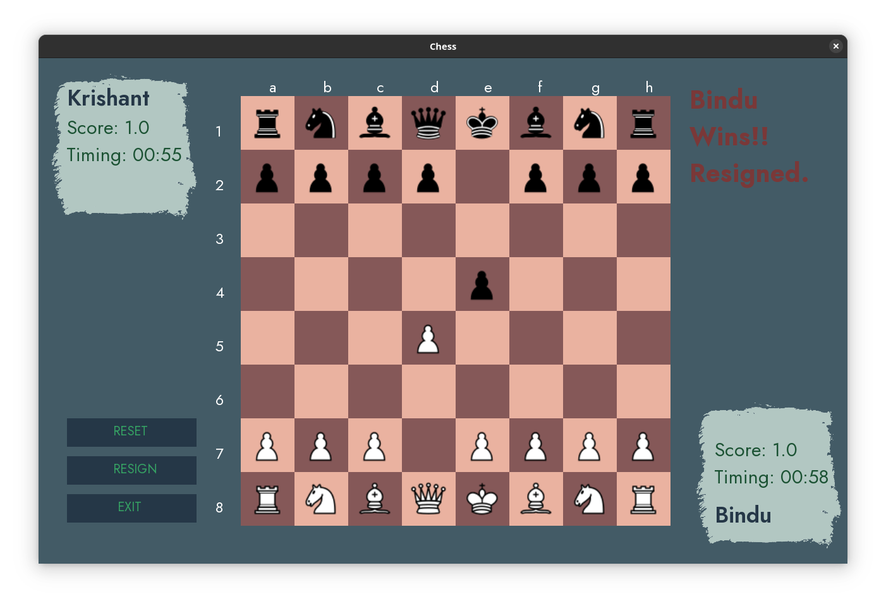

# CHESS

This is a Chess game made using SFML.

## Contributors
```
Bindu Paudel          (078BCT032)
Krishant Timilsina    (078BCT045)
```

## SCREENSHOTS


<b><center>GameMenu</center>
</b>

<b><center>Check</center>


<b><center>CheckMate</center></b>


<b><center>OutofTime</center></b>


<b><center>Promote</center>

</b>
<b><center>Resign</center></b>

## 🔨 Build

###  📋 Requirements

To setup and use the project you will need to have the following tools installed:
 - [Xmake](https://xmake.io/)

For windows, MCVC is recommended.

###  ⬇️ Installation

Clone the repository

```bash
$ git clone https://github.com/bigya01/chess_rl.git
``````


Change the working directory to the newly cloned repository:

```bash
$ cd chess_rl
```

Run xmake to install the dependencies & build the project:

```bash
$ xmake
```

Run the project after it has been built:

```bash
$ xmake run
```
